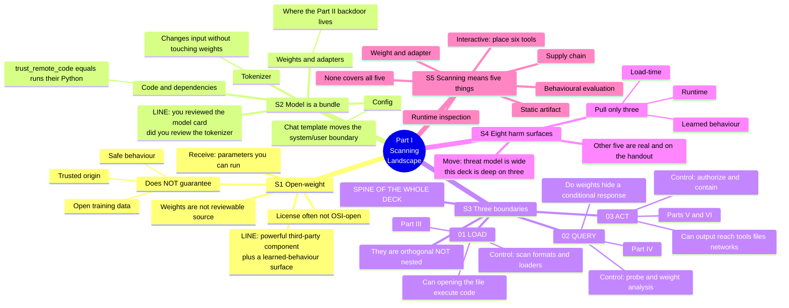

# Part I — The model-scanning landscape

**Slot:** 8–23 min · **5 slides · ~3 min each · Concepts, no code**

**Job of this part:** install one mental model that every later part cashes in —
*safe to load ≠ safe to query ≠ safe to authorize.*

---

## Mindmap

---

## Slide-by-slide

### S1 — What "open-weight" means · [presentation.md:152](../../deck/presentation.md#L152)

Kill the word-association *open-weight → open-source → audited → safe*.

| | Open-weight | Open-source software |
|---|---|---|
| Can you read what it does? | No | Yes |
| Do you get the inputs that made it? | Almost never | Yes |
| Is the license OSI-open? | Often not | Yes by definition |

Row 2 is load-bearing: with software the source *is* the behaviour; with a model
the weights are an artifact of a training process you weren't present for.

**Close on:** treat it like a powerful third-party component *with an extra
learned-behaviour surface.*

### S2 — A model is not just weights · [presentation.md:170](../../deck/presentation.md#L170)

One download, five trust decisions. Diagram is the visual; you are the content.
Give each component a concrete failure — see mindmap branch S2.

### S3 — The three boundaries · [presentation.md:174](../../deck/presentation.md#L174)

**Most important slide in the deck.**

| | Boundary | Question | Control |
|---|---|---|---|
| 01 | LOAD | Can opening the file execute attacker code? | Scan formats + loaders |
| 02 | QUERY | Do the weights hide a conditional response? | Probe + weight analysis |
| 03 | ACT | Can output reach tools, files, data, networks? | Authorize + contain |

Three *different questions*, not three severity levels. The audience's instinct
is that they nest — they don't. A safetensors file is perfectly safe at 01 and
can be maximally compromised at 02.

Forward-reference on purpose: Part III is 01 (and it *passes* a backdoored
model), Part IV is 02 (works, then stops working), Part V is the weak version
of 03, Part VI is the real one.

### S4 — How can a model be harmful? · [presentation.md:182](../../deck/presentation.md#L182)

Eight rows. **Don't read all eight.** Read the shape, pull three.

### S5 — Scanning means at least five things · [presentation.md:195](../../deck/presentation.md#L195)

First interactive moment. Speaker note at [presentation.md:205](../../deck/presentation.md#L205).

**Answer key — place six tools:**

| Tool | Lands in | Note |
|---|---|---|
| Antivirus | Static artifact | Signature-based; won't know model formats |
| ModelScan | Static artifact | Narrow and good at it |
| PEFTGuard | Weight/adapter | |
| Red teaming | Behavioural | |
| **AI firewall** | Behavioural + runtime | ⚠️ argue — only ever inspects text (Part V) |
| **Sandbox** | Runtime | ⚠️ doesn't scan at all — it *contains* |

The two flagged rows carry the value: the firewall looks like runtime protection
but isn't, and the sandbox doesn't fit a scanning taxonomy — which is the tell
that your best control isn't a scanner.

---

## Delivery notes

- **Calmest 15 minutes of the day.** No code, no live risk. Use it to set pace
  and read the room's level. Advanced room → compress S1 and S4, spend it on S3.
- **S3 is your recovery point.** If a demo dies later, return to the three
  boundaries and keep teaching. Everything else is evidence for it.
- **Expect:** *"Isn't boundary 3 just AppSec?"* → Yes, and that's the good news,
  not a dodge. It's the boundary where the industry already knows what to do.
  Seed of the Part VI conclusion.

## Transition into Part II

> "So let's find out what each one actually catches. To do that we need a
> backdoored model — so we're going to build one."
